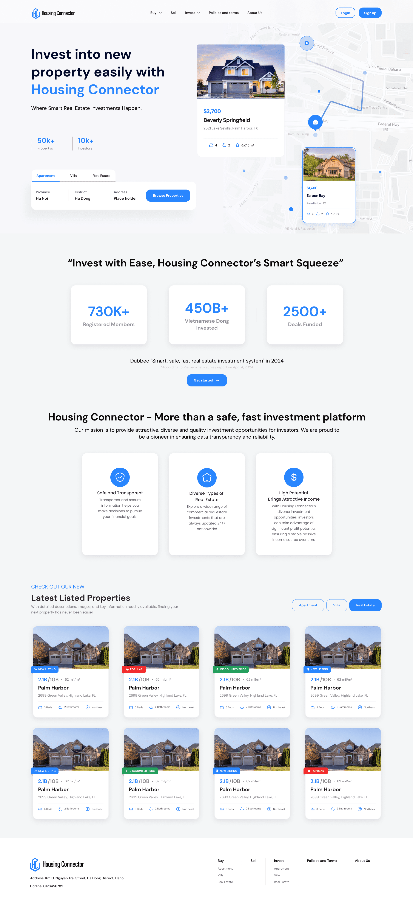
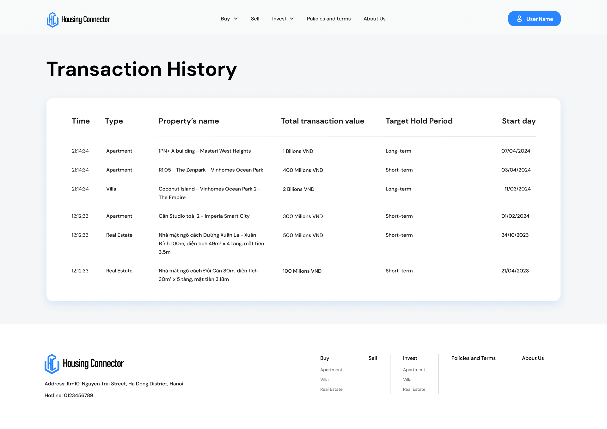
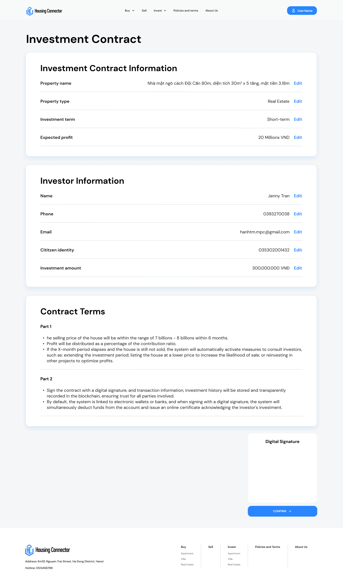

# Housing Connector

## Inspiration:
The rising trend of real estate investment and fund pooling has captured investors' attention due to its potential for value appreciation and higher financial leverage, particularly in developing markets.
However, traditional contracts often lack transparency. Leading to disputes and risks and hindering small investors from contributing jointly. Many investor at 20-30 age is low on money and can't invest on real estate easily.

To address these issues, we introduce Housing Connector, facilitating connections among small investors, investors, and real estate agents. Through Housing Connector, investors can collectively select assets and create contracts, utilizing Chainlink to record transactions and minimize risks.

More detail propose: https://docs.google.com/document/d/1SjhF71-vweysbBgF6nvqlci1axILMLVSU4hK2mFGTMc/edit?usp=sharing

**Screenshots**

https://www.youtube.com/watch?v=MZMMAx4PZXM

Team:
- Dinh Hoang Anh (Frontend Software Engineer) https://github.com/nickken253
- Nguyen Quoc Hung (Backend Software Engineer) https://github.com/quochung-cyou
- Truong Hai Quan (Frontend Software Engineer) https://github.com/quanquyt
- Phan Thuy Linh (Product Designer)
- Tran Thi Thu Uyen (Business Analyst)

## What it does
Housing Connector is a real estate investment system aimed at optimizing the investment process and minimizing disputes and overall risks for investors. It functions as a platform provides potential investment opportunities and detailed information about real estate, allowing parties to contribute capital, help them have a investment at real estate more easier. It also aiming to connecting real estate agents with data and lead information. With many data of real estate and lead, it help sales agent sell, marketing better. When the amount of sales agent increase, it lead to increase in investor join the platform since there is good sales agent here to help them sell houses, and more investor leading to more houses in platform, more buyer in platform. It create a cycle that make the platform rapidly grow up and scale up.

On the commercial aspect: The system generates revenue from transaction fees and ensures transparency and efficiency in the real estate investment process.

## Challenges we ran into
In our hackathon journey, starting as individuals unaware of blockchain and Chainlink, we came together through a university call. This was the first challenge we encountered - the lack of knowledge of essential technologies we needed for our project. It was this competition that brought our team, PTIT_Connector, closer. The name reflects our experience: just like Chainlink connects the blockchain with the real world, the hackathon linked us as a team.

We found each other by chance during the contest, and that's when the real work started. Together, we dove into the world of blockchain and Chainlink, eager to understand and use them to build something that could work in the real world - something that could solve actual problems we see in Vietnam. We learned quickly, but the process was tough, especially when we tried to take our code from a trial phase to a live network.

On our journey, we ran into several obstacles. Due to limited time and finances, we chose to create a minimum viable product (MVP) that focused on the core functionality and a real-world use case. This MVP was built on a local blockchain to give a sneak peek of our product’s potential.

As beginners in blockchain technology, we faced a steep learning path. Hard work and focus allowed us to deliver a prototype that we're truly proud of. Despite the challenges, we emerged with a product that not only reflects our efforts but also the spirit of innovation within our team. Moving forward, we are committed to evolving our project. After all, the product we've crafted is a source of pride, no matter what, especially considering it was created in just two days' time.

**License**

This project is licensed under the MIT License.

**Technologies**
Frontend:
Vite
Tailwind CSS
TypeScript
React.js

Smart Contracts/Blockchain:
- Ethereum Blockchain
- Chainlink
- Solidity
- Web3.js
- Ethers.js

Development Tools & Environment:
- Truffle Suite
- Ganache

